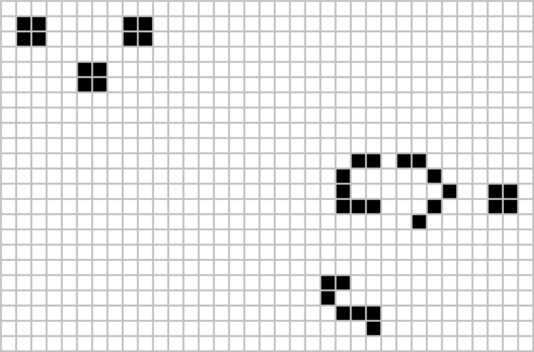

# Conway's Game of Life

> **Game of Life** is a world that consists of an infinite, two-dimensional square grid. 
> Each cell in the grid can be *alive* or *dead*. Every cell interacts with its eight 
> neighbours (i.e horizontally, vertically and diagonally adjacent cells). 

At each step the cells are updates according to the following set of rules:
1. Any live cell with fewer than two live neighbours dies (underpopulation).
2. Any live cell with two or three live neighbours lives on to the next generation.
3. Any live cell with more than three live neighbours dies (overpopulation).
4. Any dead cell with exactly three live neighbours becomes a live cell (reproduction).

## Work Log

<table>
  <tr>
    <th>Item</th><th>Date(s)</th><th>Description</th>
  </tr>
  <tr>
    <td>Assignment opened</td>
    <td>17/9/2022</td>
    <td>Members able to start understanding the objective of the assignment, and test for or compare code approaches to be used as possible solution parts</td>
  </tr>
</table>
