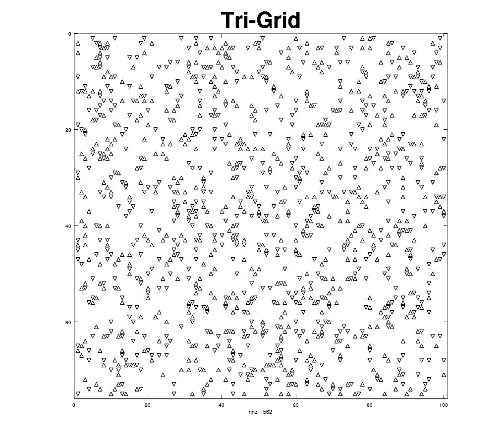
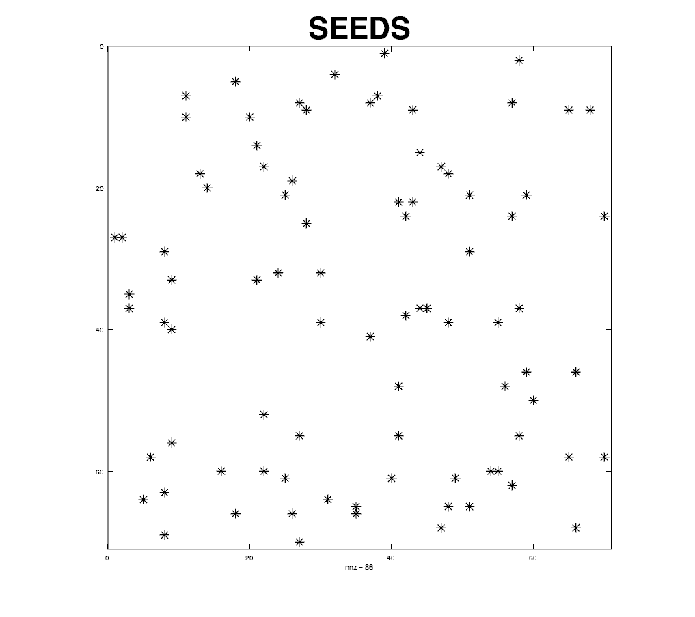
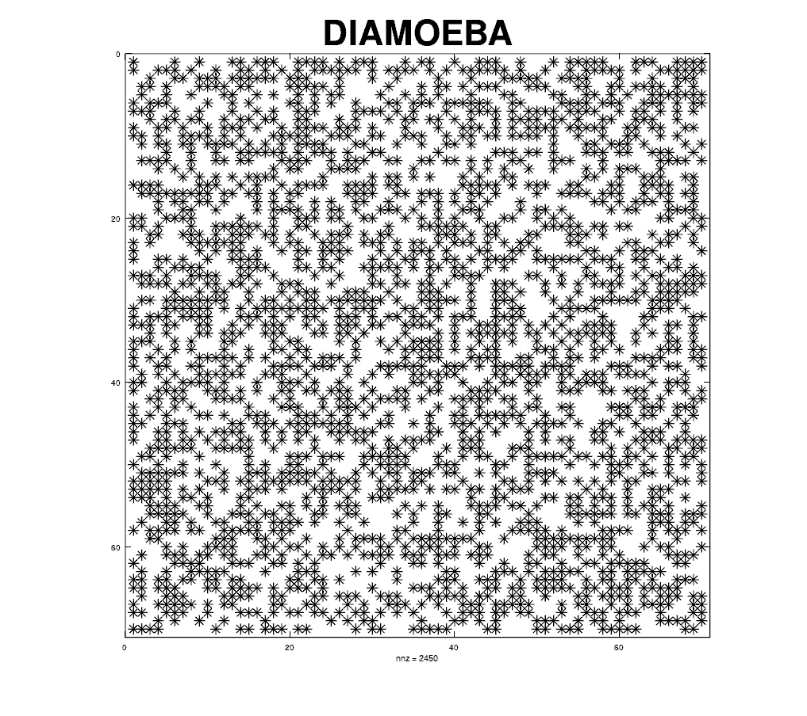

# Contents
1. [Animations (Solution Output)](#animations-solution-output)
2. [Relevant Files' Descriptions](#relevant-files-descriptions)
3. [Procedure in running each Cellular Automaton](#procedure-in-running-each-cellular-automaton)
   1. [Initialization or Loading of a Start State](#initialization-or-loading-of-a-start-state)
   2. [Within the Loop](#within-the-loop)
      1. [The Plot Function `plotGrid`](#the-plot-function-plotgrid)
         1. [Plot Marker Configurations](#plot-marker-configurations)
         2. [Aspect Ratios](#aspect-ratios)
         3. [Title Setting](#title-setting)
      2. [The Step Function](#the-step-function)
         1. [Usage of `ncAlive = nnz(A)` and `spalloc`](#usage-of-ncalive--nnza-and-spalloc)
         2. [Coordinates System](#coordinates-system)
            1. [Hexagonal Grid](#hexagonal-grid)
            2. [Triangular Grid](#triangular-grid)
         3. [Usage of Matrix Operations](#usage-of-matrix-operations)
            1. [Binary & Boolean Operations](#binary--boolean-operations)
            2. [Usage of `conv2`](#usage-of-conv2)
            3. [Usage of `getLattice`](#usage-of-getlattice)
         4. [Neighbourhood Computation](#neighbourhood-computation)
         5. [Next Cell State Computation](#next-cell-state-computation)
   3. [Maintaining Data for Re-Displaying All Final States](#maintaining-data-for-re-displaying-all-final-states)

## Animations (Solution Output)
<sup>[Back to list of contents](#contents)</sup>

<table align=center>
  <tr><th align=center colspan=2>
    Cellular Automata in Different Grids
  <th></tr>
  <tr>
    <td></td>
    <td></td>
  </tr>
  <tr>
    <td></td>
    <td></td>
  </tr>
</table>

<table align=center>
  <tr><th align=center colspan=2>
    Square Grid Cellular Automata with Different Rules
  <th></tr>
  <tr>
    <td></td>
    <td></td>
  </tr>
  <tr>
    <td>Birth=<code>1,3,5,7</code> Survival=<code>1,3,5,7</code></td>
    <td>Birth=<code>2</code> Survival=<code>NEVER</code></td>
  </tr>
  </tr>
  <tr>
    <td></td>
    <td></td>
  </tr>
   <tr>
    <td>Birth=<code>3</code> Survival=<code>ANY</code></td>
    <td>Birth=<code>3,5,6,7,8</code> Survival=<code>5,6,7,8</code></td>
  </tr>
</table>

## Relevant Files' Descriptions
<sup>[Back to list of contents](#contents)</sup>
| File | Description |
| ----- | ----------- |
| solutions.m | The main script where all functions are pieced together to demonstrate their collective result |
| plotGrid.m | The function which handles all plot/figure related procedures, e.g. setting the figure title, aspect ratio, displaying each cell according to its type (e.g. downward pointing or upward pointing triangle), etc |
| **stepFunction** <br /> (folder) | Folder containing all step functions that generally take in a current state `A0` as argument and computes and returns the next state `A1` |
| stepLife.m | The most basic and most concise step function. Refer to this file first in understanding the procedures common in all step functions. |
| stepSquare.m | Almost exactly similar to stepLife, except that it expects 2 additional input arguments, the birth condition and survival condition (vector of numbers of neighbours to cause birth or survival) |
| stepTriangle.m | Like stepLife.m, it has fixed rules (for simplicity), but has two different methods of computing neighbourhood depending on the cell's location in the grid (upward pointing or downward pointing triangle) |
| stepHex.m | Similar to stepLife.m with the exception of its own fixed set of rules (for simplicity) and neighbourhood computation due to its grid shape and coordinates system (refer down below) |
| stepHex3.m | Modification to stepHex.m. Different than the other step functions in that it computes for a world where cells have three different states e.g. dead, blue (alive) and red (alive) instead of 2 (dead and alive). This allows for a more LIFE-like activity pattern, as shown in [animation below](#Square-Grid-Cellular-Automata-with-Different-Rules)|
| getLattice.m | Generates one of two types of checkerboard pattern, i.e., either starting with 1, or starting with 0, of size determined by the `height` and `width` values passed as numeric arguments (along with the single character argument, the lattice `type`) |
| im2gif.m | Accepts as input arguments (1) a cell array of `im`s and (2) a string of the intended filename, to create a .gif image file (such as the ones used in the animations further below)|
| fig2png.m | Accepts as its arguments (1) a figure handle and (2) a string of the intended filename, to create a .png image (not animated) of everything currently on the figure |

## Procedure in running each Cellular Automaton
<sup>[Back to list of contents](#contents)</sup>

In our main [`solutions.m`](solutions.m) script consists of 8 Cellular Automata runs, all done with the same procedure, as such:

```MATLAB
% Example: The Game of LIFE; Other Cellular Automata runs too follow the same format.
label = "Game of LIFE";
grid = "square";
stepFn = @stepLife; N = 100;
A = sprand(200, 200,0.075) > 0;

for i = 1:N
  plotGrid(A, grid, label, markerScale);
  A = stepFn(A);
endfor

data(1,1:3) = {A, grid, label};
```

...which is:
- Specifying variables to be used subsequent function calls:
   - `label` - name to display on figure
   - `grid` - shape of grid which determines how the cells will be plotted
   - `stepFn` - which out of the five [step functions](#the-step-function) to use for next cell state computation
   - `A` - 2X2 sparse matrix representing cells' states at the start of the loop, which is also updated in each iteration
   - `N` - number of generations to run consecutively i.e., how many times the for-loop will run
   - `markerScale` - how big or small to make the plot marker
- Running a `for-loop` for `N` iterations, in which each generation will be [plotted](#the-plot-function-plotgrid), and `A` be updated to the [next state computed](#the-step-function)
- Its latest state `A`, along with values for `grid` and `label` will be saved to a cell array (`data` to be used at the end of the script in a combined subplot figure)[#maintaining-data-for-re-displaying-all-final-states].


### Initialization or Loading of a Start State
<sup>[Back to list of contents](#contents)</sup>


Before running a Cellular Automata "simulation", its must start with an existing state, in the form of a sparse matrix. For most of our examples in the [`solutions.m`](solutions.m) script, we have used the `sprand` function as such:

```MATLAB
A = sprand(height, width, density)
```

where `A` is the start state to be assigned a value, and `sprand` used in this manner produces a sparse matrix of random numbers (0 to 1) at a certain amount of random positions determined by the density number.

`Count of filled positions = Total positions * density`. E.g. `sparse(2, 5, 0.3)` may produce a matrix of these values:

```
0.1   0.4     0     0     0
  0     0     0   0.3     0
```

... though it will be in the form of a sparse matrix, meaning each non-zero element's row and columnt coordinates are kept in memory and the `0`s are ignored.

Alternatively, any saved state can be used too as the initial state, such as:

```MATLAB
% Example:  CELLULAR AUTOMATA - FROM SAVED STATES
label = "Gosper & Simkin Glider Guns in Game of LIFE";
grid = "square";
stepFn = @stepLife;

load savedStates guns;
A = guns; N = 240;

for i = 1:N
  plotGrid(A, grid, label, markerScale/1.3);
  A = stepFn(A);
endfor
```

### Within the Loop
<sup>[Back to list of contents](#contents)</sup>

#### The Plot Function `plotGrid`
<sup>[Back to list of contents](#contents)</sup>

##### Plot Marker Configurations
<sup>[Back to list of contents](#contents)</sup>

##### Aspect Ratios
<sup>[Back to list of contents](#contents)</sup>

##### Title Setting
<sup>[Back to list of contents](#contents)</sup>

#### The Step Function
<sup>[Back to list of contents](#contents)</sup>

##### Usage of `ncAlive = nnz(A)` and `spalloc`
<sup>[Back to list of contents](#contents)</sup>

##### Coordinates System
<sup>[Back to list of contents](#contents)</sup>

###### Hexagonal Grid
<sup>[Back to list of contents](#contents)</sup>

###### Triangular Grid
<sup>[Back to list of contents](#contents)</sup>

##### Usage of Matrix Operations
<sup>[Back to list of contents](#contents)</sup>

###### Binary & Boolean Operations
<sup>[Back to list of contents](#contents)</sup>

###### Usage of `conv2`
<sup>[Back to list of contents](#contents)</sup>

###### Usage of `getLattice`
<sup>[Back to list of contents](#contents)</sup>

##### Neighbourhood Computation
<sup>[Back to list of contents](#contents)</sup>

##### Next Cell State Computation
<sup>[Back to list of contents](#contents)</sup>

### Maintaining Data for Re-Displaying All Final States
<sup>[Back to list of contents](#contents)</sup>
